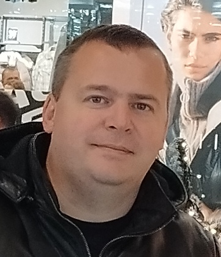

# Maksym Shtaba 

___
####CONTACTS:
Phone: +38(099) 91-36-659
Email: vokamax159@gmail.com
Discord: Maksym Shtaba(@MaximShtaba)
___
>*Responsible and hard-working person, good decision making, administrative, have communicational and interpersonal skills.*
___
####KEY SKILLS:
#####Front End
- JavaScript
- CSS, HTML, Wordpress, Elementor 

#####Web Design
- Photoshop
- Avocode
- Figma
#####***Other Skills***
*VSCode, Adobe Photoshop, Revit,  AutoCad, ArchiCAD, SolidWorks, 3dMAX, Spoken English.*
___
####CODE EXAMPLE: *(binary search)*
```
function search(nums, target){
	let left = 0; let right = nums.length-1; let mid;
	while (left<=right){
		mid = Math.round((right-left)/2)+left;
		if (target===nums[mid]) {return mid} else
		if (target<nums[mid]) {right=mid-1} else
		if (target>nums[mid]) {left=mid+1}
	}
	return -1;
}

```
___
####WORK EXPERIENCE:
####RS-School education *(st0)*
2022-12 - 2023-03
JS/FE Pre-School 2022Q4 [certificate](https://app.rs.school/certificate/4fko2v4f "Link certificate")
#####*Examples of my works:*
- [Plants](https://rolling-scopes-school.github.io/maximshtaba-JSFEPRESCHOOL2022Q4/plants/ "Plants");
- [Momentum](https://rolling-scopes-school.github.io/maximshtaba-JSFEPRESCHOOL2022Q4/momentum/#en "Momentum").

####Self employed
Dec 2016 – Jun 2018 | Part-time | Self employed
- website development (Wordpress);
- advertising placement (Google Adsense, Yandex Direct, Affiliate Networks);
- content creation and author management.

####Reactor department repair engineer/ Protection and blocking of the reactor       compartment
**"ZNPP NNEGC "Energoatom"** |  Oct 2015 – Still | Full-time| Zaporizhia Region, Ukraine
- Checking and maintaining the protections and interlocks of the safety systems of the reactor compartment
- Participation in the reconstruction of nuclear power plant safety systems.
- Analysis of technical documentation; 
- Maintenance of operability of certain equipment of the reactor compartment.

####Architect specialist 
**Ciclum/Vicosoft** |  Aug 2010 – Oct 2011 | full-time 
- Modeling of buildings and structures in Revit and ArchiCAD; 
- Drawing checking; 
- Discussion of issues with developers of drawings during meetings; 
- Generation of reports according to drawings.
____
####EDUCATION:
Higher 2004 - 2010
**Engineer, information design technologies**, National Aerospace University "Kharkiv Aviation Institute", Kharkiv, Ukraine
____
####ENGLISH SKILLS:
*I can read technical documentation in English, understand English speech, continue improving my  English skills by visiting an English teacher.*

